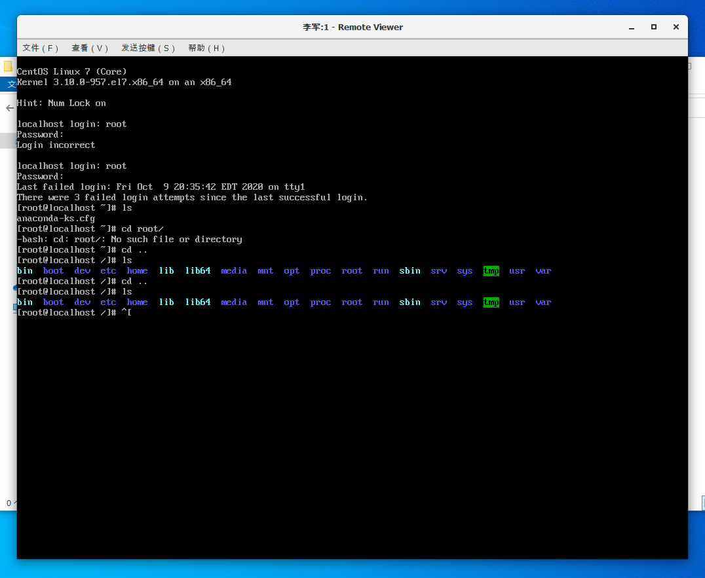
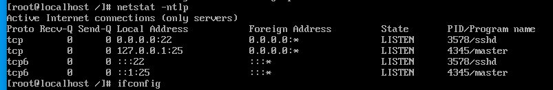
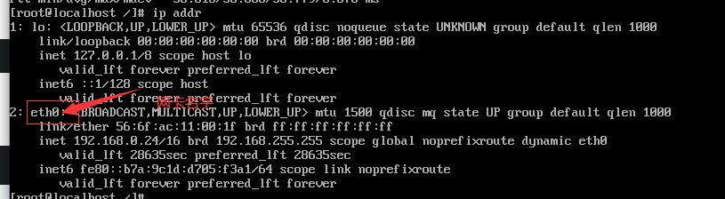
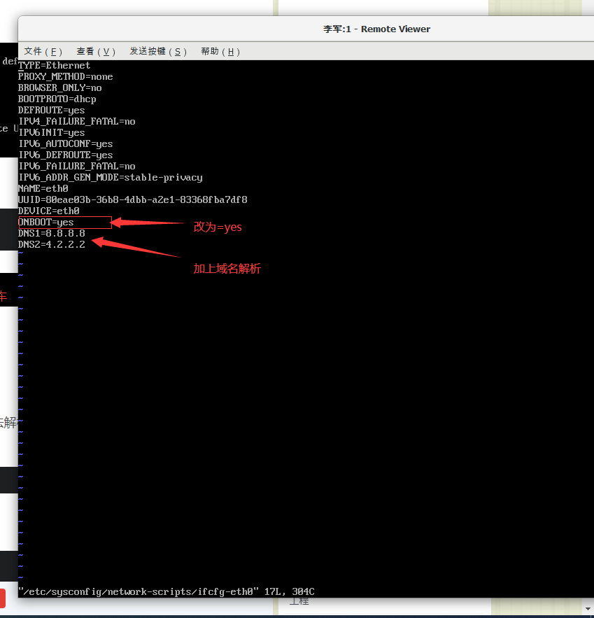
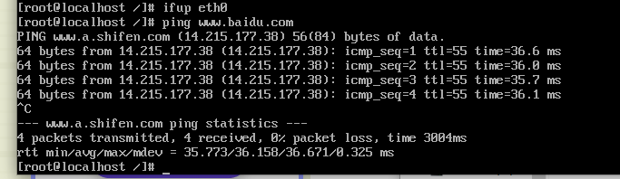
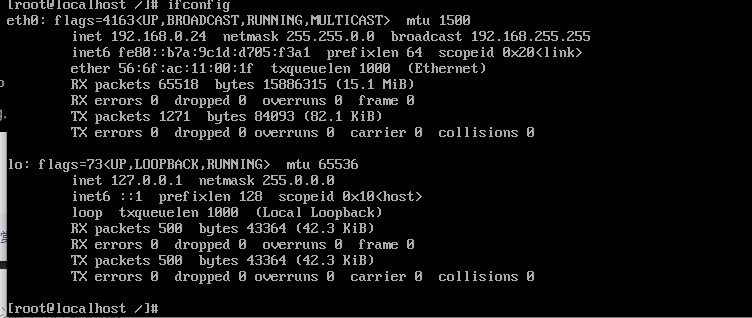
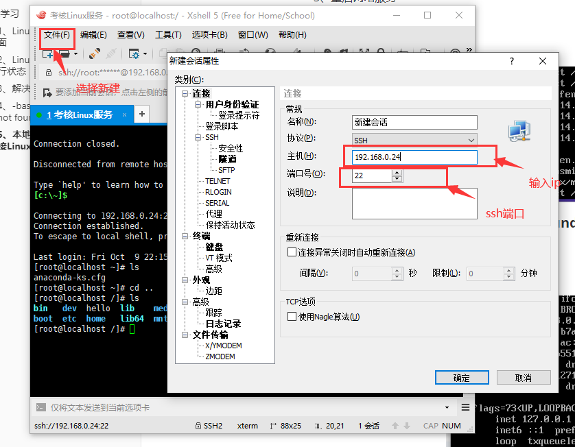
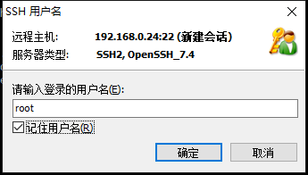
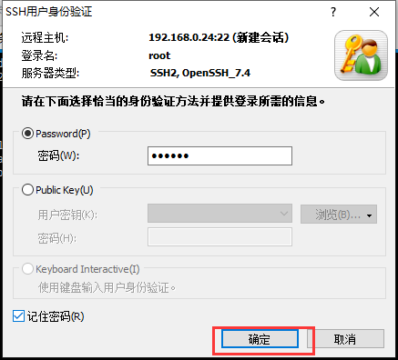
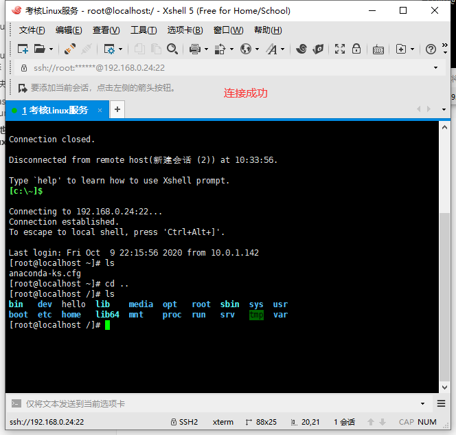

## Linux学习

#### 一、Linux操作系统安装完成界面



#### 二、Linux查看ssh服务信息及运行状态

```shell
rpm -qa | grep ssh # 1、查看系统中的ssh安装包。
```

```shell
ps -ef | grep ssh #2、这是查看服务是否运行。
```

​	img：


​	3、如果没有运行可以输入命令：

```shell
service ssh start
```

​	4、查看ssh的网络状况

​		此过程发现网络不通，进行网络上网问题解决。

```shell
netstat -ntlp
```





#### 三、解决无法上网的问题

​	1、首先查看网卡名字

​		输入命令：

```shell
ip addr
```



2、修改网络信息配置文件，打开配置文件

```shell
vi /etc/sysconfig/network-scripts/ifcfg-eth0
```



然后按 Esc键，输入:wq 意思是保存退出

3、重启网络服务

​	输入命令：ifup eth0(网卡名)

4、ping 百度，成功



#### 四、-bash: ifconfig: command not found问题解决

​	1、运行命令：

```shell
sudo yum install net-tools
```

​	2、再次测试命令：ifconfig



#### 五、本地使用xshell进行远程连接Linux服务器









#### 六、Linux基本命令学习

##### 1、grep命令学习

```shell
touch test.txt #创建test.txt文件
vi test.txt #打开test.txt文件
# 按i键进入编辑模式，并输入内容，按Esc键 随后 按:wq保存并推出
grep hello *txt #在当前目录下查找后缀为text的文件中有hello字符串的文件，并打印出该字符串的整行。
grep -i "a" test.txt  #-i 不区分大小写打印出test.txt文件中字符串a所在的行
grep -i -n "a" test.txt #-n 打印出行号
grep -c "a" test.txt #a出现的次数
grep -l "a" *txt  # 打印a出现的文件名
grep -w "李" test.txt #精确匹配“李” 的行
grep -e "李" -e "王" test.txt #同时匹配李   王
grep -v "李" test.txt #不包含李
grep -q "李" test.txt
echo $?  # -q代表的是静态模式，echo $? 返回的0代表匹配到了，1代表未匹配
```

###### 参数总结：

- --color=auto 或者 --color：表示对匹配到的文本着色显示
- -i：在搜索的时候忽略大小写
- -n：显示结果所在行号
- -c：统计匹配到的行数，注意，是匹配到的总行数，不是匹配到的次数
- -o：只显示符合条件的字符串，但是不整行显示，每个符合条件的字符串单独显示一行
- -v：输出不带关键字的行（反向查询，反向匹配）
- -w：匹配整个单词，如果是字符串中包含这个单词，则不作匹配
- -Ax：在输出的时候包含结果所在行之后的指定行数，这里指之后的x行，A：after
- -Bx：在输出的时候包含结果所在行之前的指定行数，这里指之前的x行，B：before
- -Cx：在输出的时候包含结果所在行之前和之后的指定行数，这里指之前和之后的x行，C：context
- -e：实现多个选项的匹配，逻辑or关系
- -q：静默模式，不输出任何信息，当我们只关心有没有匹配到，却不关心匹配到什么内容时，我们可以使用此命令，然后，使用"echo $?"查看是否匹配到，0表示匹配到，1表示没有匹配到。
- -P：表示使用兼容perl的正则引擎。
- -E：使用扩展正则表达式，而不是基本正则表达式，在使用"-E"选项时，相当于使用egrep。

##### 2、ls命令

```shell
ls #命令用于显示指定工作目录下之内容（列出目前工作目录所含之文件及子目录)。
```

###### 参数总结：

- -a 显示所有文件及目录 (**.** 开头的文件不会列出)
- -l 除文件名称外，亦将文件型态、权限、拥有者、文件大小等资讯详细列出
- -r 将文件以相反次序显示(原定依英文字母次序)
- -t 将文件依建立时间之先后次序列出
- -A 同 -a ，但不列出 "." (目前目录) 及 ".." (父目录)
- -F 在列出的文件名称后加一符号；例如可执行档则加 "*", 目录则加 "/"
- -R 若目录下有文件，则以下之文件亦皆依序列出

##### 3、pwd命令

```shell
pwd  #立即得出当前工作的绝对路径
```

##### 4、free 命令

```shell
free -s 10 #每10s查看一次内存使用状况
```

###### 参数总结：

- -b 　以Byte为单位显示内存使用情况。

- -k 　以KB为单位显示内存使用情况。

- -m 　以MB为单位显示内存使用情况。

- -h 　以合适的单位显示内存使用情况，最大为三位数，自动计算对应的单位值。单位有：

  ```
  B = bytes
  K = kilos
  M = megas
  G = gigas
  T = teras
  ```

- -o 　不显示缓冲区调节列。

- -s<间隔秒数> 　持续观察内存使用状况。

- -t 　显示内存总和列。

- -V 　显示版本信息。

##### 5、top命令

```shell
top #显示进程信息
top -p 139 #显示指定进程的信息
top -b #已批处理模式显示程序信息
```

###### 参数总结：

- d : 改变显示的更新速度，或是在交谈式指令列( interactive command)按 s
- q : 没有任何延迟的显示速度，如果使用者是有 superuser 的权限，则 top 将会以最高的优先序执行
- c : 切换显示模式，共有两种模式，一是只显示执行档的名称，另一种是显示完整的路径与名称S : 累积模式，会将己完成或消失的子行程 ( dead child process ) 的 CPU time 累积起来
- s : 安全模式，将交谈式指令取消, 避免潜在的危机
- i : 不显示任何闲置 (idle) 或无用 (zombie) 的行程
- n : 更新的次数，完成后将会退出 top
- b : 批次档模式，搭配 "n" 参数一起使用，可以用来将 top 的结果输出到档案内

###### 名词解释：

cpu状态信息：

- 0.0%us【user space】— 用户空间占用CPU的百分比。
- 0.3%sy【sysctl】— 内核空间占用CPU的百分比。
- 0.0%ni【】— 改变过优先级的进程占用CPU的百分比
- 99.7%id【idolt】— 空闲CPU百分比
- 0.0%wa【wait】— IO等待占用CPU的百分比
- 0.0%hi【Hardware IRQ】— 硬中断占用CPU的百分比
- 0.0%si【Software Interrupts】— 软中断占用CPU的百分比

单个进程详解：

- PID — 进程id
- USER — 进程所有者
- PR — 进程优先级
- NI — nice值。负值表示高优先级，正值表示低优先级
- VIRT — 进程使用的虚拟内存总量，单位kb。VIRT=SWAP+RES
- RES — 进程使用的、未被换出的物理内存大小，单位kb。
- RES=CODE+DATA
- SHR — 共享内存大小，单位kb
- S —进程状态。D=不可中断的睡眠状态 R=运行 S=睡眠 T=跟踪停止 Z=僵尸进程
- %CPU — 上次更新到现在的CPU时间占用百分比
- %MEM — 进程使用的物理内存百分比
- TIME+ — 进程使用的CPU时间总计，单位1/100秒
- COMMAND — 进程名称（命令名/命令行）

##### 6、df 命令

```shell
df #显示文件系统的磁盘使用情况
df root#显示磁盘使用的文件系统信息
df -h #产生可读的格式
```

###### 参数总结

- -a, --all 包含所有的具有 0 Blocks 的文件系统
- --block-size={SIZE} 使用 {SIZE} 大小的 Blocks
- -h, --human-readable 使用人类可读的格式(预设值是不加这个选项的...)
- -H, --si 很像 -h, 但是用 1000 为单位而不是用 1024
- -i, --inodes 列出 inode 资讯，不列出已使用 block
- -k, --kilobytes 就像是 --block-size=1024
- -l, --local 限制列出的文件结构
- -m, --megabytes 就像 --block-size=1048576
- --no-sync 取得资讯前不 sync (预设值)
- -P, --portability 使用 POSIX 输出格式
- --sync 在取得资讯前 sync
- -t, --type=TYPE 限制列出文件系统的 TYPE
- -T, --print-type 显示文件系统的形式
- -x, --exclude-type=TYPE 限制列出文件系统不要显示 TYPE
- --help 显示这个帮手并且离开
- --version 输出版本资讯并且离开

##### 7、ssh远程登陆其他服务

```shell
ssh root@ip #登录指定用户
ssh -p 端口号 root@ip地址 #通过端口ip连接
exit #退出当前连接
vi /etc/ssh/sshd_config #进入配置文件，可以修改port，permitRootLogin no 禁止root登录
service sshd restart #重启sshd服务
```

##### 8、scp 命令（远程拷贝）

###### 解释：

scp是Linux系统下基于ssh登陆进行安全的远程文件拷贝命令。scp是加密的，rcp不是加密的，scp是rcp的加强版。

```shell
#二台服务首次连接需要交换ssh密匙
ssh-keygen #生成ssh密匙
ssh-copy-id root@192.168.0.25  #发送密匙到对方账户
scp root@192.168.0.25:root/test.txt /root  #将对方root目录下的test.txt拷贝到本地root下
scp root/test.txt root@192.168.0.25:/root #将本地test.txt文件上传到对方/root目录下
scp -r root@192.168.0.25:/root/root /root/user #将对方root文件拷贝到user下
```

##### 9、ip 命令

```shell
ip link show #显示出整个设备的硬件相关信息
ip link set eth0 up #启动eth0这个设备
ip link set eth0 down #关闭这个设备
ip addr show #显示网卡ip信息
ip link set eth0 mtu 1400        # 设置网卡最大传输单元
ip route show # 显示系统路由
ip route list                 # 查看路由信息
```

###### 参数总结：

- link：网络设备
- address：设备上的协议（IP或IPv6）地址
- addrlabel：协议地址选择的标签配置
- route：路由表条目
- rule：路由策略数据库中的规则

##### 10、管道

###### 解释：

管道是一种通信机制，通常用于进程间的通信（也可通过socket进行网络通信），它表现出来的形式将前面每一个进程的输出（stdout）直接作为下一个进程的输入（stdin）。

```shell
cat test.txt | grep -n -c 'b' #打印出test.txt 中含有b有几行
```

##### 11、cut 命令

###### 解释：

从某一行信息中取出某部分我们想要的信息。

```shell
cat test.txt | cut -c 1-2 #打印test中每一行的1-2个字符
```

###### 参数总结：

```shell
cut -d '分隔字符' -f field // 用于分隔字符`
`cut -c 字符范围`
`[参数说明]`
`-d : 后面接分隔字符,通常与 -f 一起使用`
`-f : 根据-d 将信息分隔成数段，-f 后接数字 表示取出第几段`
`-c : 以字符为单位取出固定字符区间的信息
```

##### 12、cat 命令

###### 解释：

连接文件并打印到标准输出设备上

```shell
cat -n test.txt > test2.txt #将test中的内容加上行号输出到test2中
cat /dev/null > /etc/test.txt #清空test.txt文档内容
```

###### 参数总结：

- **-n 或 --number**：由 1 开始对所有输出的行数编号。
- **-b 或 --number-nonblank**：和 -n 相似，只不过对于空白行不编号。
- **-s 或 --squeeze-blank**：当遇到有连续两行以上的空白行，就代换为一行的空白行。
- **-v 或 --show-nonprinting**：使用 ^ 和 M- 符号，除了 LFD 和 TAB 之外。
- **-E 或 --show-ends** : 在每行结束处显示 $。
- **-T 或 --show-tabs**: 将 TAB 字符显示为 ^I。
- **-A, --show-all**：等价于 -vET。
- **-e：**等价于"-vE"选项；
- **-t：**等价于"-vT"选项；

##### 13、sort（排序）

```shell
cat test.txt | sort #对test进行排序
cat etc/passwd | sort -t ':' -k 3 #通过/etc/passwd 第3列来进行排序
```

###### 参数总结

- -f ：忽略大小写的差异，例如A 与a 视为编码相同
- -b ：忽略最前面的空格部分
- -M ：以月份的名字来排序，例如JAN, DEC 等等的排序方法
- -n ：使用『纯数字』进行排序默认是以文字型态来排序的)
- -r ：反向排序
- -u ：就是uniq ，相同的资料中，仅出现一行代表
- -t ：分隔符号，预设是用[tab] 键来分隔
- -k ：以那个区间(field) 来进行排序的意思

##### 14、Linux 重定向

```shell
ls -al > test2.txt #将显示结果输出到test文件中，如果当前文件存在给予取代
ls -al >> test2.txt #将显示结果输出到test文件中，如果当前文件存在进行累加，原数据保留
ls -al  1> list.txt   2> list.err #将显示的数据争取的输入到.txt 错误的输入到.err
ls -al 1> list.txt 2> &1 #将显示的数据，不论正确或错误均输出到 list.txt 当中！错误与正确文件输出到同一个文件中
 ls -al 1> list.txt 2> /dev/null #将显示的数据，正确的输出到 list.txt 错误的数据则予以丢弃
```

###### 重定向符号解释：

- \>        输出重定向到一个文件或设备 覆盖原来的文件
- \>!       输出重定向到一个文件或设备 强制覆盖原来的文件
- \>>       输出重定向到一个文件或设备 追加原来的文件
- <        输入重定向到一个程序

###### 1.2标准错误重定向符号

- 2>       将一个标准错误输出重定向到一个文件或设备 覆盖原来的文件 b-shell
- 2>>      将一个标准错误输出重定向到一个文件或设备 追加到原来的文件
- 2>&1     将一个标准错误输出重定向到标准输出 注释:1 可能就是代表 标准输出
- \>&       将一个标准错误输出重定向到一个文件或设备 覆盖原来的文件 c-shell
- |&       将一个标准错误 管道 输送 到另一个命令作为输入

###### 1.3命令重导向示例

在 bash 命令执行的过程中，主要有三种输出入的状况，分别是：

- 标准输入；代码为 0 ；或称为 stdin ；使用的方式为 <
-  标准输出：代码为 1 ；或称为 stdout；使用的方式为 1>
- 错误输出：代码为 2 ；或称为 stderr；使用的方式为 2>

#### 七、shell脚本学习

##### 1、第一个shell程序

```shell
vim test.sh #创建一个test.sh文本,写入一下内容
#!/bin/bash
echo "Hello world !"
#:wq保存退出
 chmod +x ./hello.sh ##使脚本具有执行权限
 ./test.sh  #执行脚本
 /bin/sh test.sh  #这种方式也行执行脚本
```

