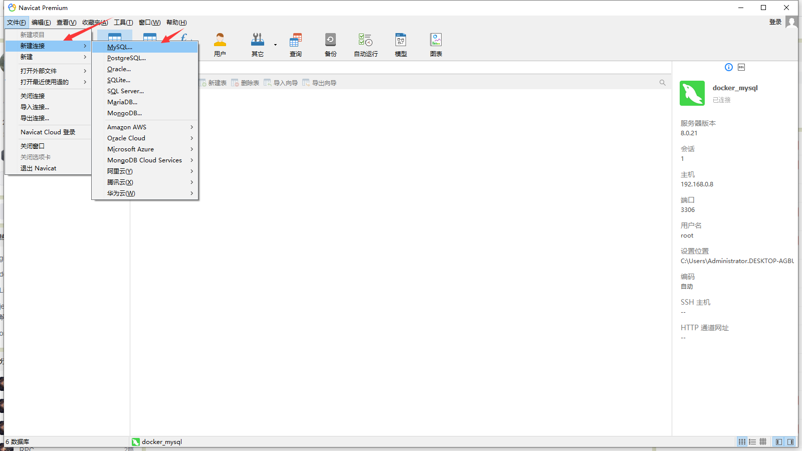
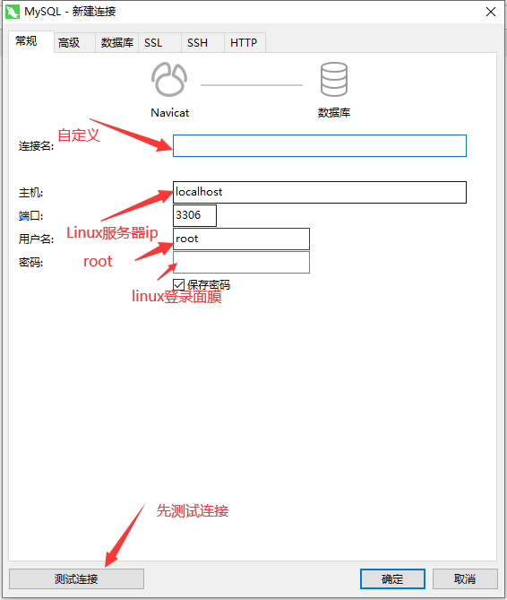

## Navicat连接docker容器中的MySQL

### 一、在docker上运行mysql容器

#### 1、拉去MySQL8的镜像

```shell
systemctl start docker
docker search mysql  #查找镜像
docker pull mysql	#拉去镜像
docker images #查看镜像
docker run -d -p 3306:3306 --name mysql mysql #启动容器
docker ps #查看是否启动
```

#### 2、打开Navicat





#### 3、创建数据库ghostcloud_demo

```sql
create database if not exists ghostcloud_demo
default character set utf8
default collate utf8_general_ci
```

#### 4、创建user_table表

```sql
DROP TABLE IF EXISTS `user_table`;
CREATE TABLE `user_table`  (
  `id` int(0) NOT NULL,
  `user_name` varchar(255) CHARACTER SET utf8 COLLATE utf8_general_ci NOT NULL COMMENT '用户名',
  `pwd` varchar(255) CHARACTER SET utf8 COLLATE utf8_general_ci NULL DEFAULT NULL COMMENT '密码',
  PRIMARY KEY (`id`) USING BTREE
) ENGINE = InnoDB CHARACTER SET = utf8 COLLATE = utf8_general_ci ROW_FORMAT = Dynamic;
```

#### 5、加入数据

```sql
INSERT INTO `user_table` VALUES (1, 'lijun', '123456');
```

