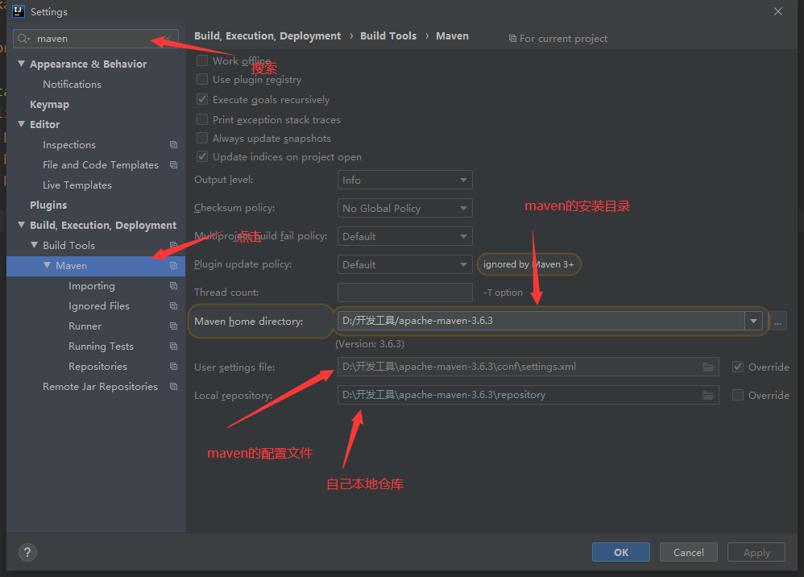

## idea绑定maven，spring boot

### 一、[下载idea](https://www.jetbrains.com/idea/download/#section=windows)

### 二、安装idea

### 三、绑定maven

#### 1、打开idea，选择file，setting




#### 2、重启

### 四、新建spring boot项目

##### 1、[maven官方仓库地址](https://mvnrepository.com/artifact/)

##### 2、新建project


##### 3、打开pom文件，添加依赖

```xml
<dependencies>
    <!-- https://mvnrepository.com/artifact/org.springframework.boot/spring-boot-starter-web -->
    <dependency>
        <groupId>org.springframework.boot</groupId>
        <artifactId>spring-boot-starter-web</artifactId>
        <version>2.2.2.RELEASE</version>
    </dependency>
    <!-- https://mvnrepository.com/artifact/org.springframework.boot/spring-boot-starter-test -->
    <dependency>
        <groupId>org.springframework.boot</groupId>
        <artifactId>spring-boot-starter-test</artifactId>
        <version>2.2.2.RELEASE</version>
        <scope>test</scope>
    </dependency>

</dependencies>
```

##### 4、查看依赖导入情况


##### 5、在src/java下新建包 /com/ghostcloud

新建java启动类

```java
package com.ghostcloud;

import org.springframework.boot.SpringApplication;
import org.springframework.boot.autoconfigure.SpringBootApplication;

@SpringBootApplication //springboot启动注解 
public class Ghostcloud {
    public static void main(String[] args) {
        SpringApplication.run(Ghostcloud.class,args);
    }
}

```

##### 6、在 resources目录下新建application.yml

```yaml
server:
  port: 8080  #启动端口
```

##### 7、编写/hello接口

ghostcloud包下新建 controller包，代表这是一个控制层

新建HelloController.java

```java
package com.ghostcloud.controller;

import org.springframework.web.bind.annotation.RequestMapping;
import org.springframework.web.bind.annotation.RestController;

@RestController	//不返回视图
public class HelloController {
    @RequestMapping("/hello")
    public String hello(){
        return "Hello Springboot!";	//响应后返回的内容
    }
}

```

##### 8、在启动类启动，访问localhost:8080/hello

