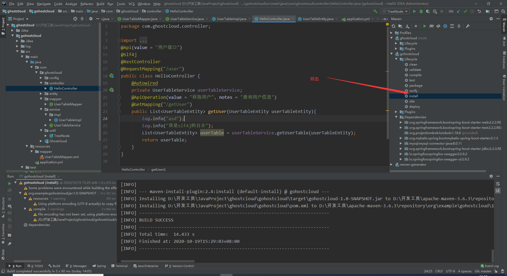
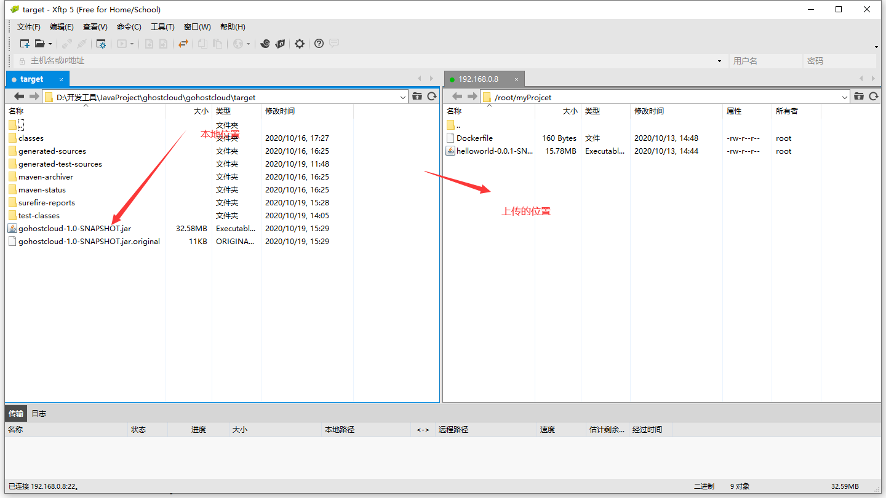

## jar包打包成镜像

### 一、maven导出jar



jar地址：`D:\开发工具\apache-maven-3.6.3\repository\org\example\gohostcloud\1.0-SNAPSHOT\gohostcloud-1.0-SNAPSHOT.jar`

### 二、xftp上传文件



### 三、编写Dockerfile文件

```dockerfile
FROM java:8

MAINTAINER Ma LiJun

COPY gohostcloud-1.0-SNAPSHOT.jar /gohostcloud-1.0-SNAPSHOT.jar

CMD java -jar /gohostcloud-1.0-SNAPSHOT.jar

EXPOSE  8080
```

### 四、启动

```shell
docker build -t web80 .
```

### 五、启动镜像

```shell
docker run -d -p 8080:8080 --name web8080 web80
```

### 六、测试

访问http://192.168.0.8:8080/user/getUser