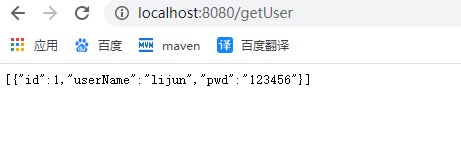

## springboot集成mybatis

### 一、创建实体类

#### 1、创建entity包，用来存放实体类

```java
package com.ghostcloud.entity;

import lombok.Data;

@Data
public class UserTableEntity {
    private int id;
    private String user_name;
    private String pwd;
}

```

### 二、创建service层（业务层）

#### 1、创建service包，包下新建impl包

service包中存放业务接口，而impl包下是service包中接口的实现类

在service包下创建UserTableService.java

```java
package com.ghostcloud.service;

import com.ghostcloud.entity.UserTableEntity;

import java.util.List;

public interface UserTableService {
    /**
     * 查询用户
     * @param userTableEntity
     * @return
     */
    public List<UserTableEntity> getUserTable(UserTableEntity userTableEntity);
}

```

在Impl包下实现UserTableService接口

```java
package com.ghostcloud.service.impl;

import com.ghostcloud.entity.UserTableEntity;
import com.ghostcloud.service.UserTableService;
import org.springframework.stereotype.Service;

import java.util.List;

@Service
public class UserTableImpl implements UserTableService {
    @Override
    public List<UserTableEntity> getUserTable(UserTableEntity userTableEntity) {
        //业务实现


        return null;
    }
}

```

@Service :这个注解代表此类是业务层，也相当于把此类注册到spring容器中。

### 三、集成mybatis

#### 1、导入mybatis依赖

```xml
<dependency>
            <groupId>org.mybatis.spring.boot</groupId>
            <artifactId>mybatis-spring-boot-starter</artifactId>
            <version>2.1.3</version>
        </dependency>
```

#### 2、导入MySQL依赖与jdbc驱动

```xml
<dependency>
            <groupId>mysql</groupId>
            <artifactId>mysql-connector-java</artifactId>
            <version>8.0.11</version>
</dependency>
<dependency>
            <groupId>org.springframework.boot</groupId>
            <artifactId>spring-boot-starter-jdbc</artifactId>
            <version>2.3.3.RELEASE</version>
</dependency>
```

#### 3、application.yml中配置连接驱动

```yaml
spring:
  datasource:
    username: root
    password: root
    url: jdbc:mysql://192.168.0.8/ghostcloud_demo?useUnicode=true&characterEncoding=UTF-8&serverTimezone=GMT%2B8&useSSL=false
    driver-class-name: com.mysql.cj.jdbc.Driver
```

#### 4、在ghostcloud包下新建mapper（dao）包

此层是持久层，编写查询接口

创建UserTableMapper.java

```java
package com.ghostcloud.mapper;

import com.ghostcloud.entity.UserTableEntity;
import org.apache.ibatis.annotations.Mapper;

import java.util.List;

@Mapper
public interface UserTableMapper {
    /**
     * 查询用户
     * @param userTableEntity
     * @return
     */
    public List<UserTableEntity> getUserTable(UserTableEntity userTableEntity);
}

```

@Mapper: 此注解代表这是持久层文件，相当于注册到容器中，方便使用

#### 5、在resources资源文件下新建mapper包

存放xml文件，也就是查询语句，新建UserTableMapper.xml

```xml
<?xml version="1.0" encoding="UTF-8"?>
<!DOCTYPE mapper PUBLIC "-//mybatis.org//DTD Mapper 3.0//EN"
        "http://mybatis.org/dtd/mybatis-3-mapper.dtd">
<mapper namespace="com.ghostcloud.mapper.UserTableMapper">
    <resultMap id="UserTableMap" type="com.ghostcloud.entity.UserTableEntity">
        <result column="id" property="id" jdbcType="INTEGER"/>
        <result column="user_name" property="userName" jdbcType="VARCHAR"/>
        <result column="pwd" property="pwd" jdbcType="VARCHAR"/>
    </resultMap>


    <select id="getUserTable"  resultMap="UserTableMap" parameterType="java.util.List">
        select * from user_table a
        <where>
            <trim prefixOverrides="AND | OR">
                <if test="id !=null and id != 0">
                    a.id = id;
                </if>
                <if test="userName !=null and userName != ''">
                    a.user_name = userName;
                </if>
                <if test="pwd !=null and pwd != ''">
                    a.pwd = pwd;
                </if>
            </trim>
        </where>
    </select>
</mapper>


```

#### 6、application.yml 配置mybatis

```yaml
mybatis:
  mapper-locations: classpath:mapper/*.xml   #xml资源文件
  type-aliases-package: com.ghostcloud.entity	#实体类
```

#### 7、在控制层进行数据库访问测试

##### 1、业务层（service）进行dao接口调用

```java
package com.ghostcloud.service.impl;

import com.ghostcloud.entity.UserTableEntity;
import com.ghostcloud.mapper.UserTableMapper;
import com.ghostcloud.service.UserTableService;
import org.springframework.stereotype.Service;

import javax.annotation.Resource;
import java.util.List;

@Service
public class UserTableImpl implements UserTableService {
    @Resource		//获取UserTableMapper 中的方法，等于new
    private UserTableMapper userTableMapper;
    @Override
    public List<UserTableEntity> getUserTable(UserTableEntity userTableEntity) {
        //业务实现
        List<UserTableEntity> userTable = userTableMapper.getUserTable(userTableEntity);
        return userTable;
    }
}

```

##### 2、控制层进行接口编写

```java
package com.ghostcloud.controller;

import com.ghostcloud.entity.UserTableEntity;
import com.ghostcloud.service.UserTableService;
import lombok.extern.slf4j.Slf4j;
import org.springframework.beans.factory.annotation.Autowired;
import org.springframework.web.bind.annotation.RequestMapping;
import org.springframework.web.bind.annotation.RestController;

import java.util.List;

@Slf4j
@RestController
public class HelloController {
    @Autowired	//获取UserTableService类，等于new
    private UserTableService userTableService;
    @RequestMapping("/getUser")
    public List<UserTableEntity> getUser(){
        log.info("我是slf4j的日志");
        UserTableEntity userTableEntity = new UserTableEntity();
        List<UserTableEntity> userTable = userTableService.getUserTable(userTableEntity);
        return userTable;
    }
}

```

#### 8、访问`localhost:8080/getUser`



#### 9、开启sql日志

在application.yml中添加

```yaml
logging:
  level:
    com.ghostcloud.mapper: debug    #开启sql日志
```

