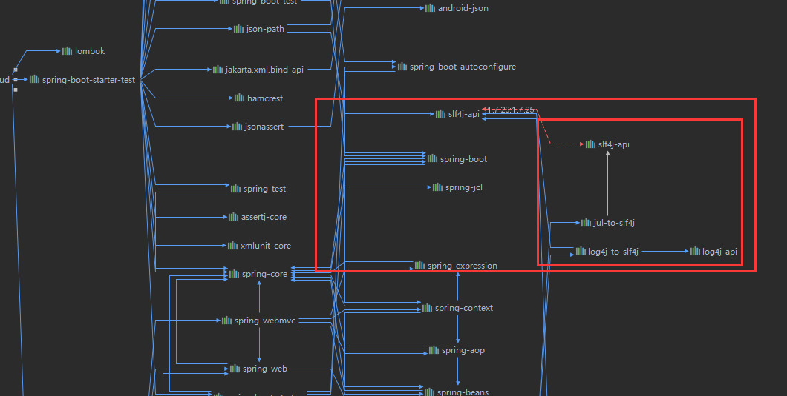
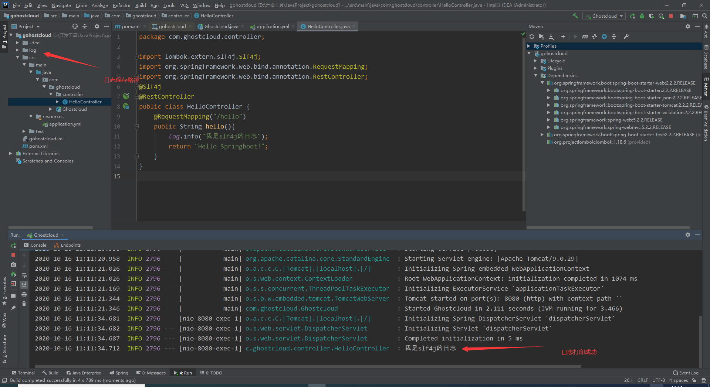
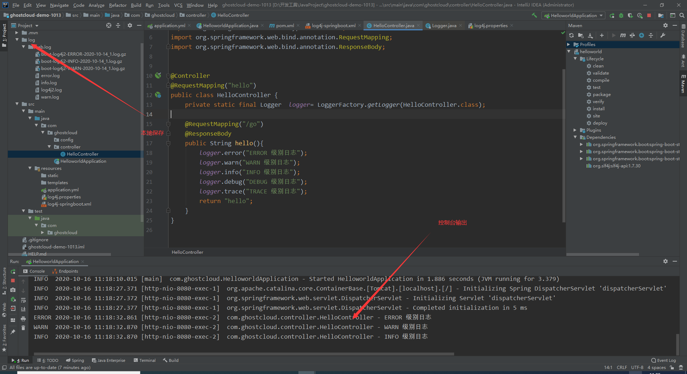

## springboot集成slf4j和log4j2

### 一、slf4j

在ghostcloud项目上进行

### 1、下载Lombok插件并导入依赖

```xml
<dependency>
            <groupId>org.projectlombok</groupId>
            <artifactId>lombok</artifactId>
            <version>1.18.6</version>
            <scope>provided</scope>
        </dependency>
```

### 2、springboot集成了slf4j

打开pom文件的依赖关系图可以看出



### 3、在配置文件中application.yml开启

```yaml
logging:
  level: 
    root: info			#日志的级别
  file:
    path: log/ghostcloud.log		#日志存放的位置
```

### 4、在控制层进行试验

```java
package com.ghostcloud.controller;

import lombok.extern.slf4j.Slf4j;
import org.springframework.web.bind.annotation.RequestMapping;
import org.springframework.web.bind.annotation.RestController;
@Slf4j
@RestController
public class HelloController {
    @RequestMapping("/hello")
    public String hello(){
        log.info("我是slf4j的日志");
        return "Hello Springboot!";
    }
}

```

### 5、查看结果



### 二、log4j2

### 1、新建一个工程

### 2、去掉springboot自带的logging

```xml
<dependency>
            <groupId>org.springframework.boot</groupId>
            <artifactId>spring-boot-starter-web</artifactId>
            <exclusions>
                <!--                去掉自带的logging-->
                <exclusion>
                    <groupId>org.springframework.boot</groupId>
                    <artifactId>spring-boot-starter-logging</artifactId>
                </exclusion>
            </exclusions>
</dependency>
```

### 3、导入依赖

```xml
 <dependency>
            <groupId>org.springframework.boot</groupId>
            <artifactId>spring-boot-starter-log4j2</artifactId>
            <version>2.3.4.RELEASE</version>
</dependency>
```

### 4、在resources下新建log4j2的配置文件(.xml)

```xml
<?xml version="1.0" encoding="UTF-8"?>
<!--monitorInterval：Log4j2 自动检测修改配置文件和重新配置本身，设置间隔秒数-->
<configuration monitorInterval="5">
    <!--日志级别以及优先级排序: OFF > FATAL > ERROR > WARN > INFO > DEBUG > TRACE > ALL -->
    <!--变量配置-->
    <Properties>
        <!-- 格式化输出：
            %date表示日期，%thread表示线程名，
            %-5level：级别从左显示5个字符宽度
            %msg：日志消息，%n是换行符-->
        <!-- %logger{36} 表示 Logger 名字最长36个字符 -->
        <property name="LOG_PATTERN" value="%-5level %date{yyy-MM-dd HH:mm:ss.SSS} [%thread]  %logger{36} - %msg%n" />
        <!-- 定义日志存储的路径，不要配置相对路径 -->
        <property name="FILE_PATH" value="log/web.log" />
        <property name="FILE_NAME" value="boot-log4j2" />
    </Properties>

    <appenders>
        <console name="Console" target="SYSTEM_OUT">
            <!--输出日志的格式-->
            <PatternLayout pattern="${LOG_PATTERN}"/>
            <!--控制台只输出level及其以上级别的信息（onMatch），其他的直接拒绝（onMismatch）-->
            <ThresholdFilter level="info" onMatch="ACCEPT" onMismatch="DENY"/>
        </console>

        <!--文件会打印出所有信息-->
        <File name="Filelog" fileName="${FILE_PATH}/log4j2.log" append="true">
            <PatternLayout pattern="${LOG_PATTERN}"/>
        </File>

        <!-- 这个会打印出所有的info及以下级别的信息，每次大小超过size，则这size大小的日志会自动存入按年份-月份建立的文件夹下面并进行压缩，作为存档-->
        <RollingFile name="RollingFileInfo" fileName="${FILE_PATH}/info.log" filePattern="${FILE_PATH}/${FILE_NAME}-INFO-%d{yyyy-MM-dd}_%i.log.gz">
            <!--控制台只输出level及以上级别的信息（onMatch），其他的直接拒绝（onMismatch）-->
            <ThresholdFilter level="info" onMatch="ACCEPT" onMismatch="DENY"/>
            <PatternLayout pattern="${LOG_PATTERN}"/>
            <Policies>
                <!--interval属性用来指定多久滚动一次，默认是1 hour-->
                <TimeBasedTriggeringPolicy interval="1"/>
                <SizeBasedTriggeringPolicy size="10MB"/>
            </Policies>
            <!-- DefaultRolloverStrategy同一文件夹下15个文件开始覆盖-->
            <DefaultRolloverStrategy max="15"/>
        </RollingFile>

        <!-- 这个会打印出所有的warn及以下级别的信息，每次大小超过size，则这size大小的日志会自动存入按年份-月份建立的文件夹下面并进行压缩，作为存档-->
        <RollingFile name="RollingFileWarn" fileName="${FILE_PATH}/warn.log" filePattern="${FILE_PATH}/${FILE_NAME}-WARN-%d{yyyy-MM-dd}_%i.log.gz">
            <!--控制台只输出level及以上级别的信息（onMatch），其他的直接拒绝（onMismatch）-->
            <ThresholdFilter level="warn" onMatch="ACCEPT" onMismatch="DENY"/>
            <PatternLayout pattern="${LOG_PATTERN}"/>
            <Policies>
                <!--interval属性用来指定多久滚动一次，默认是1 hour-->
                <TimeBasedTriggeringPolicy interval="1"/>
                <SizeBasedTriggeringPolicy size="10MB"/>
            </Policies>
            <!-- DefaultRolloverStrategy同一文件夹下15个文件开始覆盖-->
            <DefaultRolloverStrategy max="15"/>
        </RollingFile>

        <!-- 这个会打印出所有的error及以下级别的信息，每次大小超过size，则这size大小的日志会自动存入按年份-月份建立的文件夹下面并进行压缩，作为存档-->
        <RollingFile name="RollingFileError" fileName="${FILE_PATH}/error.log" filePattern="${FILE_PATH}/${FILE_NAME}-ERROR-%d{yyyy-MM-dd}_%i.log.gz">
            <!--控制台只输出level及以上级别的信息（onMatch），其他的直接拒绝（onMismatch）-->
            <ThresholdFilter level="error" onMatch="ACCEPT" onMismatch="DENY"/>
            <PatternLayout pattern="${LOG_PATTERN}"/>
            <Policies>
                <!--interval属性用来指定多久滚动一次，默认是1 hour-->
                <TimeBasedTriggeringPolicy interval="1"/>
                <SizeBasedTriggeringPolicy size="10MB"/>
            </Policies>
            <!-- DefaultRolloverStrategy同一文件夹下15个文件开始覆盖-->
            <DefaultRolloverStrategy max="15"/>
        </RollingFile>
    </appenders>

    <!--Logger节点用来单独指定日志的形式，比如要为指定包下的class指定不同的日志级别等。-->
    <!--然后定义loggers，只有定义了logger并引入的appender，appender才会生效-->
    <loggers>
        <!--过滤掉spring和mybatis的一些无用的DEBUG信息-->
        <logger name="org.mybatis" level="info" additivity="false">
            <AppenderRef ref="Console"/>
        </logger>
        <!--监控系统信息-->
        <!--若是additivity设为false，则 子Logger 只会在自己的appender里输出，而不会在 父Logger 的appender里输出。-->
        <Logger name="org.springframework" level="info" additivity="false">
            <AppenderRef ref="Console"/>
        </Logger>
        <root level="info">
            <appender-ref ref="Console"/>
            <appender-ref ref="Filelog"/>
            <appender-ref ref="RollingFileInfo"/>
            <appender-ref ref="RollingFileWarn"/>
            <appender-ref ref="RollingFileError"/>
        </root>
    </loggers>

</configuration>
```

### 5、在配置application.yml中绑定配置xml文件

```yaml
#启动日志
logging:
  config: classpath:log4j-springboot.xml
```

### 6、控制层进行试验

```java
package com.ghostcloud.controller;

import org.slf4j.Logger;
import org.slf4j.LoggerFactory;
import org.springframework.stereotype.Controller;
import org.springframework.web.bind.annotation.RequestMapping;
import org.springframework.web.bind.annotation.ResponseBody;


@Controller
@RequestMapping("hello")
public class HelloController {
    private static final Logger  logger= LoggerFactory.getLogger(HelloController.class);

    @RequestMapping("/go")
    @ResponseBody
    public String hello(){
        logger.error("ERROR 级别日志");
        logger.warn("WARN 级别日志");
        logger.info("INFO 级别日志");
        logger.debug("DEBUG 级别日志");
        logger.trace("TRACE 级别日志");
        return "hello";
    }
}

```

### 7、结果

