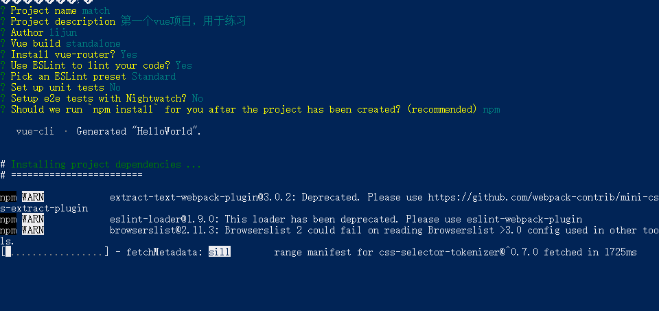

## 快速搭建vue

### 1、下载node.js

地址：https://nodejs.org/en/

### 2、检查node安装与淘宝cnpm

2.1、win+r 打开dos命令，输入node -v查看版本，npm -v 查看npm是否安装

2.2、输入 npm install -g cnpm –registry=https://registry.npm.taobao.org 安装淘宝镜像

### 3、使用cnpm爆红

3.1、原因：因为在此系统上禁止运行脚本

3.2、解决方法：

1. 以管理员身份运行power shell
2. 输入set-ExecutionPolicy RemoteSigned
3. 输入A 回车
4. 再次输入cnpm -v就可以运行了

### 4、搭建vue项目环境

4.1、全局安装vue-cli

　　cnpm install --globcal vue-cli

4.2、进入你的项目目录，创建一个基于 webpack 模板的新项目: vue init webpack 项目名

说明：

　　　　Vue build ==> 打包方式，回车即可；

　　　　Install vue-router ==> 是否要安装 vue-router，项目中肯定要使用到 所以Y 回车；

　　　　Use ESLint to lint your code ==> 是否需要 js 语法检测 目前我们不需要 所以 n 回车；

　　　　Set up unit tests ==> 是否安装 单元测试工具 目前我们不需要 所以 n 回车；

　　　　Setup e2e tests with Nightwatch ==> 是否需要 端到端测试工具 目前我们不需要 所以 n 回车；



安装成功后，项目文件夹中会多出一个目录：　node_modules

4.3、npm run dev，启动项目

### 5、项目结构描述

1、build：构建脚本目录

　　　　1）build.js  ==> 生产环境构建脚本；``

　　　　2）check-versions.js  ==> 检查npm，node.js版本；

　　　　3）utils.js  ==> 构建相关工具方法；

　　　　4）vue-loader.conf.js  ==> 配置了css加载器以及编译css之后自动添加前缀；

　　　　5）webpack.base.conf.js  ==> webpack基本配置；

　　　　6）webpack.dev.conf.js  ==> webpack开发环境配置；

　　　　7）webpack.prod.conf.js  ==> webpack生产环境配置；

　　2、config：项目配置

　　　　1）dev.env.js  ==> 开发环境变量；

　　　　2）index.js  ==> 项目配置文件；

　　　　3）prod.env.js  ==> 生产环境变量；

　　3、node_modules：npm 加载的项目依赖模块

　　4、src：这里是我们要开发的目录，基本上要做的事情都在这个目录里。里面包含了几个目录及文件：

　　　　1）assets：资源目录，放置一些图片或者公共js、公共css。这里的资源会被webpack构建；

　　　　2）components：组件目录，我们写的组件就放在这个目录里面；

　　　　3）router：前端路由，我们需要配置的路由路径写在index.js里面；

　　　　4）App.vue：根组件；

　　　　5）main.js：入口js文件；

　　5、static：静态资源目录，如图片、字体等。不会被webpack构建

　　6、index.html：首页入口文件，可以添加一些 meta 信息等

　　7、package.json：npm包配置文件，定义了项目的npm脚本，依赖包等信息``

　　8、README.md：项目的说明文档，markdown 格式

　　9、.xxxx文件：这些是一些配置文件，包括语法配置，git配置等

### 6、下载VSCode 编辑器

下载地址：https://code.visualstudio.com/

安装完成后打开第一个vue项目

### 7、开始编辑第一个vue项目

1、在components目录下新建一个views目录，里面写我们的vue组件

　　　　1）开始我们的第一个组件：

　　　　a：在views目录下新建First.vue

　　　　b：在router目录下的index.js里面配置路由路径

```js
import Vue from 'vue'
import Router from 'vue-router'
import HelloWorld from '@/components/HelloWorld'
import First from '@/components/views/First'
Vue.use(Router)

export default new Router({
  routes: [
    {
      path: '/',
      name: 'HelloWorld',
      component: HelloWorld
    },
    {
      path: '/first',
      name: 'First',
      component: First
    }
  ]
})

```

2、标签解释：

​	c：template 写 html，script写 js，style写样式

在First.vue写入如下代码

```vue
<template>
<div class="first">
{{msg}}
</div>
</template>
<script>
export default {
    name: "First",
    data() {
        return{
            msg: "你好啊，小伙子！"
        };
    }
};
</script>
```

保存，自动刷新

访问 http://localhost:8010/#/first

### 注意：

一个组件下只能有一个并列的 div，以下写法是错误：

```vue
<template>
<div class="first">
{{msg}}
</div>
<div class="first">
{{msg}}
</div>
</template>
```

数据要写在 return 里面，而不是像文档那样子写，以下写法错误：

```vue
<script>
export default {
    name: "First",
    data() {
         msg: "你好啊，小伙子！"
    }
};
</script>
```

