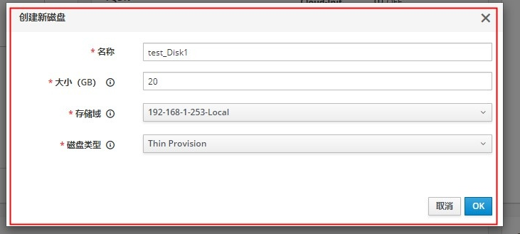
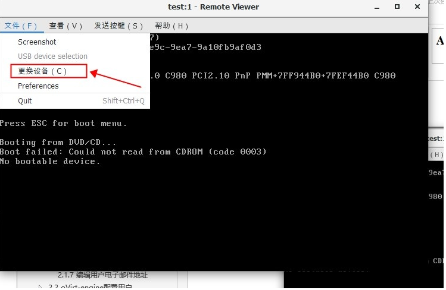

## 通过oVrit平台新建虚拟机

### 步骤：

1、在c:/windows/system32/drivers/etc/hosts 目录下，在末尾添加  192.168.0.221 engine.ovirt.com

2、下载安装  virt-viewer

3、登录虚拟机门户

4、点击右上角按钮创建虚拟机

5、配置参数

6、修改镜像

7、进行安装

## git 相关命令的使用

1、下载项目到本地(克隆)：

​	   git clone 项目地址

2、创建分支（master为主分支）

​	   git branch 分支名

3、查看当前分支（前面带*的代表当前分支）

​		git branch

4、查看所有分支

​		git branch -a

5、移动到分支

​		git chekout 分支名

6、提交

​		git add 文件名

​		git commit -m "输入提交的信息"

​		git push origin 分支名

